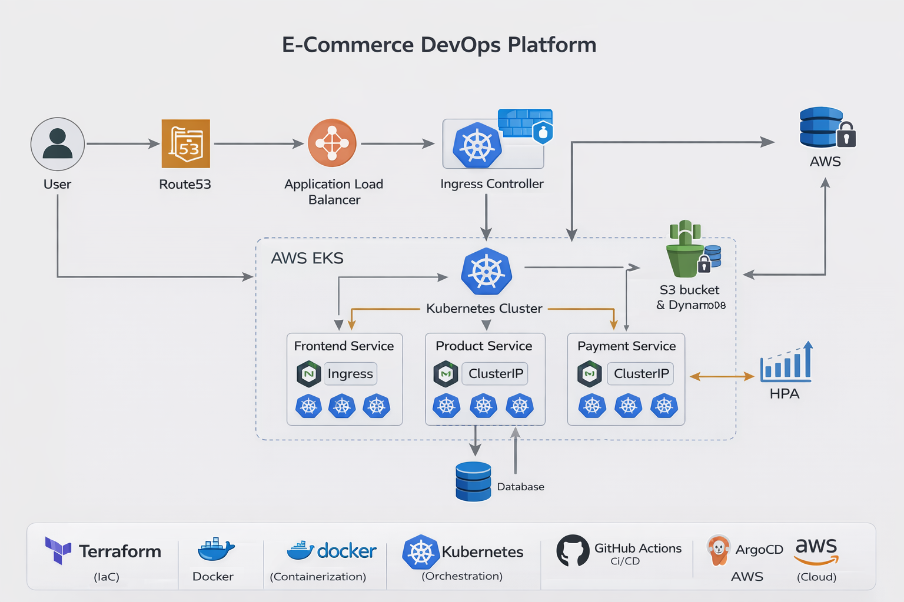

# 🛒 E-Commerce DevOps Platform


---

## 📌 Project Overview

This project demonstrates a production-style end-to-end DevOps implementation for a microservices-based e-commerce application deployed on AWS.

It showcases infrastructure automation, containerization, Kubernetes orchestration, GitOps deployment strategy, and CI/CD automation following real-world DevOps best practices.

The objective of this project is to simulate a scalable and automated cloud-native system similar to enterprise environments.

---

## 🏗 Architecture Overview

The application follows a microservices architecture deployed on AWS EKS.

### 🔄 Traffic Flow

User  
→ Route53  
→ Application Load Balancer  
→ NGINX Ingress Controller  
→ Frontend Service  
→ Product & Payment Services  
→ Internal Cluster Communication  

---

## 🖼 Architecture Diagram

<p align="center">
  
</p>

---

## 🛠 Tech Stack

### ☁ Cloud
- AWS (VPC, EKS, IAM, Route53, S3, DynamoDB)

### 🏗 Infrastructure as Code
- Terraform (Modular Structure)
- Remote backend (S3)
- State locking (DynamoDB)

### 📦 Containerization
- Docker
- Docker Compose (Local Development)

### ☸ Orchestration
- Kubernetes
- NGINX Ingress Controller
- Horizontal Pod Autoscaler (HPA)

### 🔁 CI/CD & GitOps
- GitHub Actions (CI)
- Argo CD (Continuous Delivery - GitOps)

---

## 🚀 Infrastructure Implementation

Infrastructure is provisioned using Terraform with:

- Custom VPC
- Public Subnets
- Modular configuration
- Remote state management
- Output variables for resource referencing

State management is secured using S3 backend with DynamoDB locking.

---

## ☸ Kubernetes Implementation

Each microservice includes:

- Deployment manifest
- ClusterIP Service
- Resource requests and limits
- Liveness and readiness probes
- Horizontal Pod Autoscaler (HPA)

Ingress is configured to expose only the frontend service externally.

Internal services communicate using Kubernetes DNS-based service discovery.

---

## 🔁 CI/CD Workflow

1. Developer pushes code to GitHub
2. GitHub Actions:
   - Builds Docker image
   - Pushes image to Docker Hub
   - Updates Kubernetes deployment manifest
3. Argo CD detects changes
4. Kubernetes cluster syncs automatically
5. Rolling update deploys new version

This ensures automated, traceable, and production-ready deployments.

---

## 📈 Scalability & Reliability

- CPU-based auto-scaling using HPA
- Defined resource requests and limits
- Rolling updates for zero downtime
- Separation between local and production environments

---

## 🧠 What I Implemented

- Designed AWS infrastructure using Terraform
- Configured remote state backend with S3 & DynamoDB
- Containerized microservices using Docker
- Implemented Kubernetes Deployments & Services
- Configured Ingress routing
- Implemented Horizontal Pod Autoscaler
- Designed CI pipeline using GitHub Actions
- Implemented GitOps delivery using Argo CD

---

## 📂 Project Structure

```
ecommerce-devops-platform
│
├── terraform/              # Infrastructure as Code
├── kubernetes/             # Kubernetes manifests
├── docker-compose.yml      # Local development setup
├── .github/workflows/      # CI pipeline
├── docs/                   # Architecture diagrams
└── README.md
```

---

## 🔮 Future Improvements

- TLS configuration with ACM
- Helm templating
- Monitoring stack (Prometheus & Grafana)
- Blue/Green deployments
- Network Policies

---
